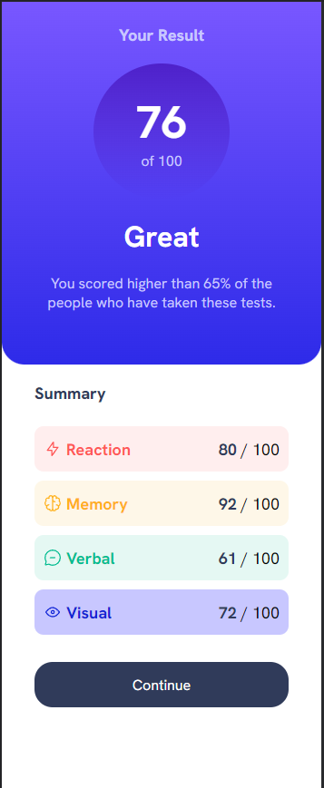

# Frontend Mentor - Results summary component solution

This is a solution to the [Results summary component challenge on Frontend Mentor](https://www.frontendmentor.io/challenges/results-summary-component-CE_K6s0maV). Frontend Mentor challenges help you improve your coding skills by building realistic projects. 

## Table of contents

  - [The challenge](#the-challenge)
  - [Screenshot](#screenshot)
  - [Links](#links)
- [My process](#my-process)
  - [Built with](#built-with)
  - [What I learned](#what-i-learned)
- [Author](#author)
- [Acknowledgments](#acknowledgments)

**Note: Delete this note and update the table of contents based on what sections you keep.**

## Overview

### The challenge

Users should be able to:

- View the optimal layout for the interface depending on their device's screen size
- See hover and focus states for all interactive elements on the page

### Screenshot

### Links

- Solution URL: [Add solution URL here](https://your-solution-url.com)
- Live Site URL: [Add live site URL here](https://your-live-site-url.com)

## My process
  First, I assess all the possible div that are needed. Then used flex as a display property to ensure responsiveness. I followed all the color and did my best replicating the design.
### Built with

- Semantic HTML5 markup
- CSS3

### What I learned

I have learned the use of media query to customize the overall design on the specific viewport size.

- Frontend Mentor - [@yourusername](https://www.frontendmentor.io/profile/sai-nvsc)
- Twitter - [@yourusername](https://www.twitter.com/cycynvsc)

